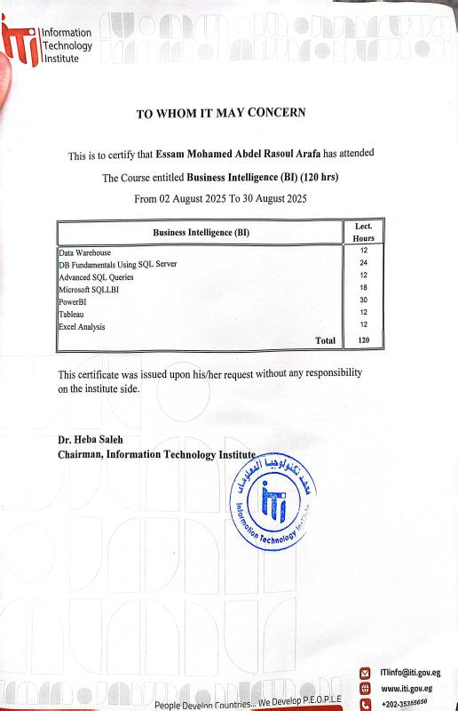

# 📜 Certificates Portfolio

Welcome to my certificates repository. This section highlights my completed professional training programs.

---

## 🎓 Business Intelligence (BI) Certificate

- 🏫 Issued by: Information Technology Institute (ITI)
- 📅 Duration: August 2025 (120 Hours)
- 📊 Field: Business Intelligence & Data Analysis

---

## 📚 Covered Topics

- Data Warehousing
- SQL Server Fundamentals
- Advanced SQL Queries
- Microsoft SQL BI
- Power BI
- Tableau
- Excel Analysis

---

## 💡 What I Learned

This program provided hands-on experience in:
- Data Cleaning & Transformation
- Writing complex SQL queries
- Building dashboards using Power BI & Tableau
- Understanding Data Warehousing concepts

---

## 🚀 Career Direction

This certificate is part of my journey to becoming a **Data Analyst**, focusing on:
- Excel
- SQL
- Power BI
- Data Visualization.
